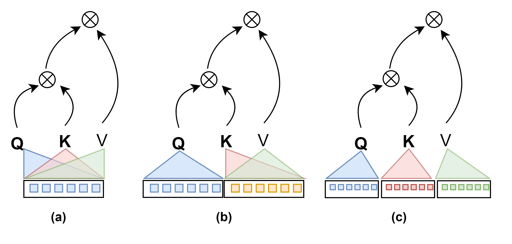
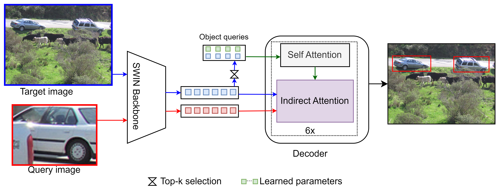

This repository is the official PyTorch implementation of the paper "Indirect attention: IA-DETR for one shot object detection". The paper will be provided once reviewed. 


-------
&nbsp;
## Brief Introduction

IA-DETR is a state-of-the-art one-shot object detector based on DETR and indirect attention. The indirect attention exploits the transformers for correlating the three main elements of object queries, target image, and query image all at once. The figure below shows what an indirect attention is and how it differs from the self-attention and cross-attention.


<div align=center>  

</div>


<div align=center>  

</div>


-------
&nbsp;

## Installation

### Pre-Requisites
You must have NVIDIA GPUs to run the codes.

The implementation codes are developed and tested with the following environment setups:
- 8x NVIDIA V100 GPUs (32GB)
- CUDA 12.0
- Python == 3.9
- PyTorch == 2.1.0+cu121, TorchVision == 0.16.0+cu121
- cython, pycocotools, tqdm, scipy
- see requirements.txt for more


### Data Preparation

#### Pascal VOC for one-shot object detection
Get the Pascal VOC 2012, and 2007 datasets from the official site.
First extract query image patchs using the  file in "scripts" folder. After cropping the query image patches, please organize your dataset and extracted query images as following:
```
code_root/
└── data/
    └── pascalvoc/
        ├── cropped_pascalvoc/     # VOC image query crops - training
        ├── cropped_pascalvoc_test/     # VOC image query crops - testing
        └── PascalVOC/                    # Pascal VOC 2012 dataset
            ├── ImageSets/
            └── Annotations/
        └── VOC2007/                    # Pascal VOC 2007 dataset
            ├── ImageSets/
            └── Annotations/
        └── VOC2007_test/               # Pascal VOC 2007 dataset
            ├── ImageSets/
            └── Annotations/
    ...
```

#### MS COCO for one-shot object detection
Download the MS COCO dataset.

For the COCO dataset the images used as reference are obtained by taking out patches corresponding to the predicted bounding boxes of Mask R-CNN. The bounding boxes have to meet the conditions of IOU threshold > 0.5 and score confidence > 0.7. The reference images are available at

* Reference Images: [Google Drive from CoAE](https://drive.google.com/file/d/1O1AQtjozgpdtuETGE6X4UItpqcVPUiXH/view?usp=sharing)

Next, crop the reference images using the correct file in the "scripts" folder. Make sure to use the good paths for the images, annotations, and reference images.

Your datasets should be organized as following:
```
code_root/
└── data/
    └── coco/
        ├── annotations/
            └── instances_train2017.json/
            └── instances_val2017.json/
        ├── coco_crop/
        ├── coco_crop_test/
        ├── train2017/
        ├── val2017/
    ...
```

### Training

#### Training on single node

```
GPUS_PER_NODE=<num gpus> ./tools/run_dist_launch.sh <num gpus> <path to config file>
```

#### Training on multiple nodes

On each node, run the following script:

```
MASTER_ADDR=<master node IP address> GPUS_PER_NODE=<num gpus> NODE_RANK=<rank> ./tools/run_dist_launch.sh <num gpus> <path to config file> 
```

### Evaluation

To evalute a plain-detr model, please run the following script:

```
 <path to config file> --eval --resume <path to plain-detr model>
```
